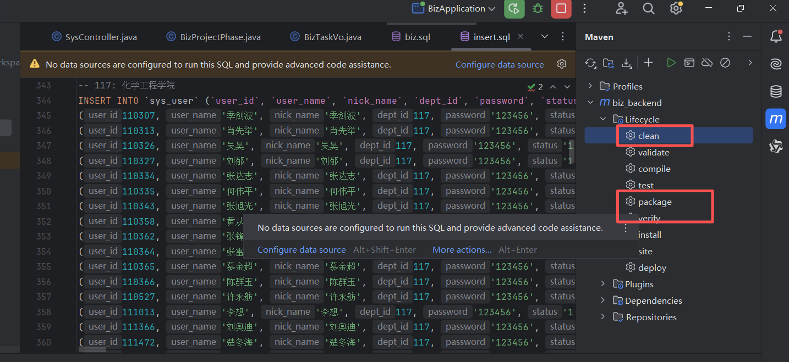
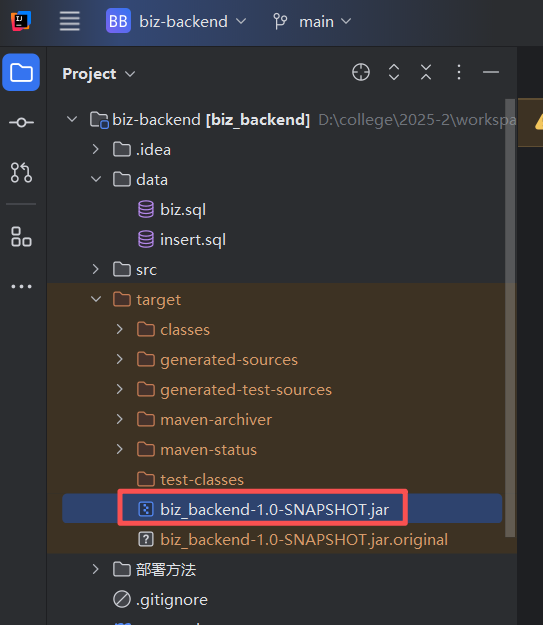
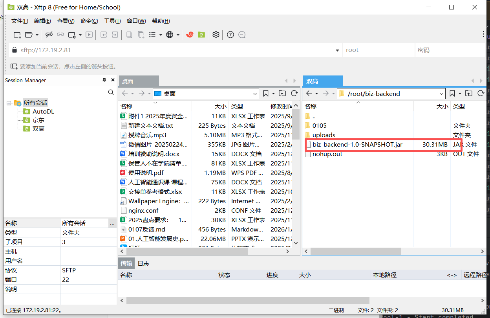
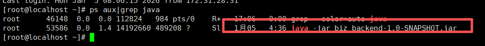
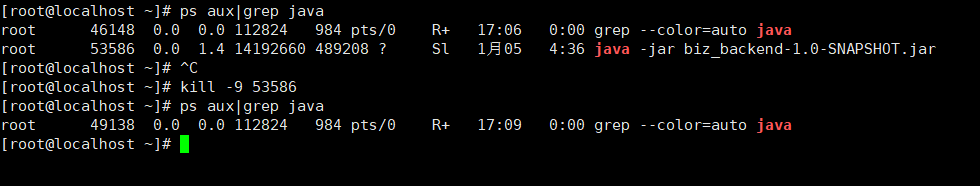
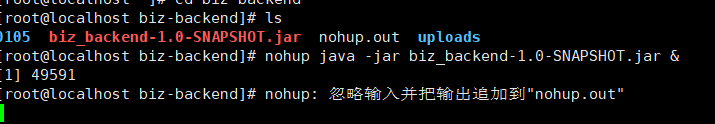
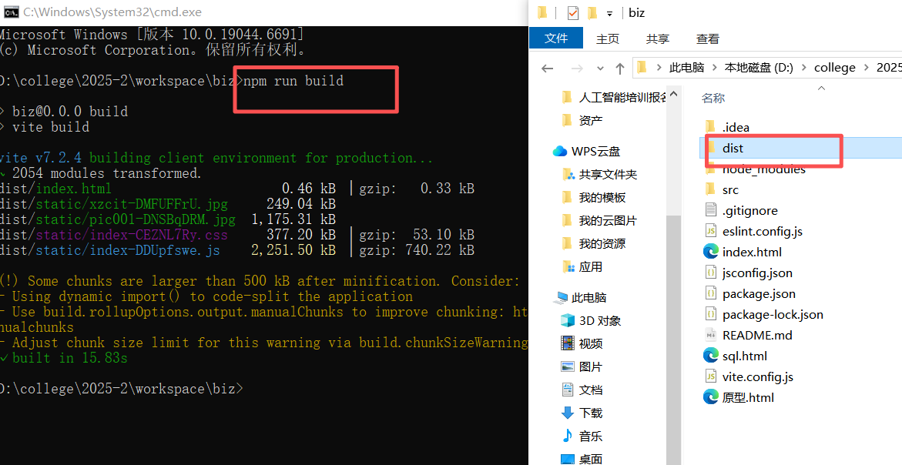
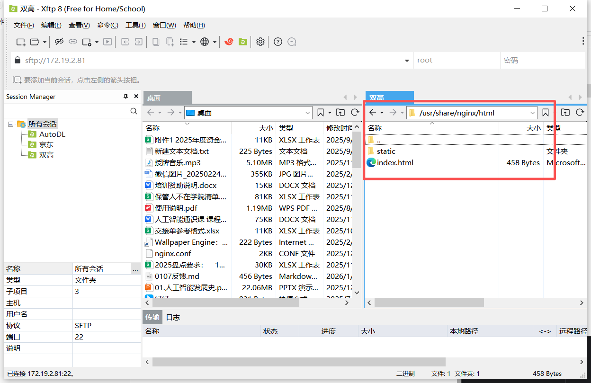
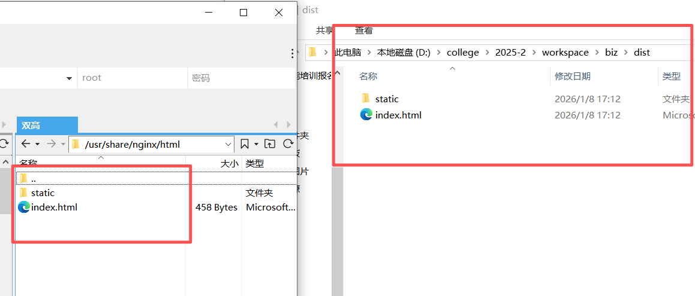

### 服务器账号密码

```
ip地址:172.19.2.81
用户名:root
密码:Xzcit@xg.2025.8

数据库账号密码
账号：root
密码：Xxxy@123
```

### 后端部署

打包之前记得将数据库密码改为服务器的数据库密码

先后双击clean和package



找到target目录下生成的jar包



将jar包移动到服务器任意位置



输入命令```ps aux|grep java```查看当前运行的程序



输入 ```kill -9 [PID]```中断原有后端程序（如```kill -9 53586```)



输入命令```nohup java -jar biz_backend-1.0-SNAPSHOT.jar &```，后台运行



### 前端部署

修改```vite.config.js```，将ip地址改为服务器ip地址


运行```npm run builds```生成dist文件夹



在服务器中找到目录```/usr/share/nginx/html```



将生成的dist文件**里面**的内容，上传到该目录下，替换原有文件

部署完毕